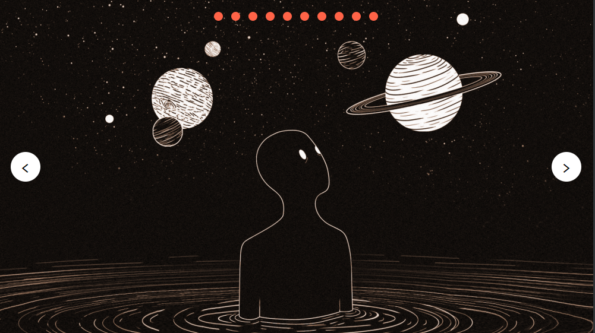

# Pure-CSS-Slider

#### By _**Adam Craig**_

## Description

_A web-based responsive slider/slideshow built with pure HTML/CSS/SASS. Includes 10 images (5 PNGs and 5 SVGs). Users can navigate forward, backwards and loop through slides. Pagination is included through bubbles at the top of the slider, which can be clicked to jump to specific slides._

## Setup/Installation Requirements

*_The easy way: view the project in GitHub pages at https://adamcraig.github.io/Pure-CSS-Slider/

*_For local development:_

* _Using the command line, clone the repository to your desktop using the command "git clone https://github.com/AdamCraig/Pure-CSS-Slider" or through GitHub Desktop_
* _Navigate to the cloned local repository and install dependencies (really just gulp is used) with "npm install"_
*_Open index.html in any web browser._

## Design / Development Process Notes

*_The design of the slider is meant to be minimalist, simple, and clean, without taking a lot of time doing anything too flashy._
*_Development considerations for a functional, responsive slider without using a single line of JavaScript were tricky at first. I settled on the simplicity of using hidden radio buttons with the same name in order to take user input for changing between slides. In this approach, users click arrows/bubbles that are actually HTML labels for radio button inputs tied to slides within the slider. All slides are "hidden" by default via opacity and z-index, and only the slide adjacent to the checked input is shown. I wanted to avoid using any "pseudo-code" or loops through SASS as I prefer to keep logic and style layers separate. One drawback of this approach was that there is no current support for swiping through slides on mobile devices, as I could not find a way to tie swiping to radio button input interaction through HTML/CSS alone. Future iterations of this slider would likely need refactoring in order to incorporate this feature.

## Technologies Used

_HTML5, CSS, SASS, Node.js/Gulp (for SASS compilation)_
